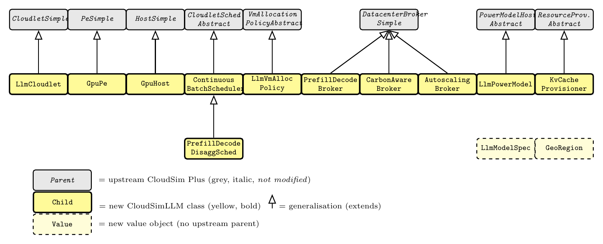

<a id="top"></a>

# CloudSimLLM

**A Datacenter-Scale Simulation Framework for Energy- and SLO-Aware LLM Inference Serving**

[](https://www.gnu.org/licenses/gpl-3.0)
[](https://openjdk.org/projects/jdk/25/)
[](https://github.com/cloudsimplus/cloudsimplus)

CloudSimLLM is a non-invasive extension of [CloudSim Plus](https://github.com/cloudsimplus/cloudsimplus) that adds first-class large-language-model (LLM) serving primitives — prefill/decode phases, PagedAttention KV cache, continuous batching, phase-aware GPU energy, Splitwise-style disaggregation, carbon-aware geo-routing, and burst auto-scaling — to a mature event-driven cloud simulator. The whole extension lives under one Java package (`org.cloudsimplus.llm`); deleting that package leaves CloudSim Plus exactly as shipped.

<p align="center">
  
  <br/>
  <em>Figure 1 — CloudSimLLM class hierarchy. Grey italic boxes are upstream CloudSim Plus <code>non-sealed abstract</code> types (none modified). Yellow boxes are the eleven new CloudSimLLM classes; dashed yellow boxes are new value objects with no upstream parent. Hollow triangles indicate UML generalisation (extends).</em>
</p>

---

## What's new

| Concern | CloudSim Plus | CloudSimLLM (this work) |
| --- | --- | --- |
| Workload | MIPS-Cloudlet | `LlmCloudlet` with `(input, output, sloClass, phase)` and a phase-aware lifecycle (`WAITING → PREFILL → DECODE → DONE`) |
| Hardware | `Pe`, `Host` | `GpuPe` (peak/effective FP16 + HBM, TDP/idle) and `GpuHost` (NVLink + inter-host fabric, region) |
| Scheduling | `CloudletSchedulerAbstract` | `ContinuousBatchScheduler` (drives Algorithm 1: admission, phase choice, paged KV) and `PrefillDecodeDisaggScheduler` (Splitwise role) |
| Brokers | `DatacenterBrokerSimple` | `PrefillDecodeBroker` (decode-shadow handoff), `CarbonAwareBroker` (3 routing policies + `GeoRegion`), `AutoscalingBroker` (warm pool + reactive/predictive policies) |
| Power & resources | `PowerModelHostAbstract`, `ResourceProvisionerAbstract` | `LlmPowerModel` (POLCA-style ρ_dec factor) and `KvCacheProvisioner` (PagedAttention block list) |
| Allocation | `VmAllocationPolicyAbstract` | `LlmVmAllocationPolicy` (HBM-aware, SKU-pinning) |

Twelve calibrated equations capture the LLM workload's resource dynamics in closed form (paper §4); six of those parameters are recovered from vLLM-style measurements via `scipy.optimize.curve_fit` (paper §6.1).

## What you can answer

The four bundled case studies in `tools/experiments/` show what the simulator is for:

1. **§6.3 Splitwise disaggregation** — sweep prefill/decode GPU ratios, prompt distributions, and KV-fabric bandwidths at constant 8-GPU budget. Result: a 5-seed-mean **5.12× P99 TTFT speedup on medium prompts** but a **1.42× slowdown on long prompts** at fixed budget; KV bandwidth above 100 GB/s is essentially flat.
2. **§6.4 Heterogeneous GPU mix** — sweep all (A100, H100, L40S) compositions across workloads. Result: homogeneous fleets dominate the cost-latency frontier in our setup; mixes are rarely Pareto-optimal at constant device count.
3. **§6.5 Carbon-aware geo-routing** — three regions × three policies × 24 hours × three workloads. Result: pure `CarbonAware` routing cuts emissions by **84–91 %** but pays a **2×–4× TTFT penalty** on medium and long prompts; the `BLENDED(α)` policy exposes the trade-off.
4. **§6.6 Bursty workload auto-scaling** — `STATIC` / `REACTIVE` / `PREDICTIVE` × low/med/high bursts × 5/15/30 s cold-starts. Result: elastic policies match the static baseline's SLO attainment at **≈49 % lower active VM-hours** (read as a cost-equivalence study; absolute SLO attainment is low at the chosen TTFT thresholds).

Total: **990 cells (198 configurations × 5 seeds), ≈108 s on a laptop** (8-core Apple M2, JDK 25). An equivalent on-hardware sweep would take ≈50 h of GPU-time per seed — a ≈2600× speedup.

---

## Quick start

### Build

```bash
git clone https://github.com/FUJIANUT/CloudSimLLM.git
cd CloudSimLLM
./mvnw -DskipTests=true package          # JDK 25 required
```

### Run a single Splitwise example

```bash
JAVA_HOME=$(/usr/libexec/java_home -v 25) ./mvnw -q exec:java \
    -Dexec.mainClass=org.cloudsimplus.llm.example.SplitwiseExample
```

### Reproduce all four case studies (5 seeds, ≈108 s)

```bash
# 1. Run the four parametric sweeps (Java sim) → CSV
python3 tools/experiments/run_splitwise_sweep.py \
    --output tools/experiments/results/splitwise_sweep.csv \
    --seeds "42,43,44,45,46" --jobs 4
python3 tools/experiments/run_heterogeneous_sweep.py \
    --output tools/experiments/results/heterogeneous_sweep.csv \
    --seeds "42,43,44,45,46" --jobs 4
python3 tools/experiments/run_geo_sweep.py \
    --output tools/experiments/results/geo_sweep.csv \
    --seeds "42,43,44,45,46" --jobs 4
python3 tools/experiments/run_autoscale_sweep.py \
    --output tools/experiments/results/autoscale_sweep.csv \
    --seeds "42,43,44,45,46" --jobs 4

# 2. Generate figures (with 5-seed error bars) and summary tables
python3 tools/analysis/case_study_1_cli.py \
    --results tools/experiments/results/splitwise_sweep.csv     --outdir tools/analysis/figures/
python3 tools/analysis/case_study_2_cli.py \
    --results tools/experiments/results/heterogeneous_sweep.csv --outdir tools/analysis/figures/
python3 tools/analysis/case_study_3_cli.py \
    --results tools/experiments/results/geo_sweep.csv           --outdir tools/analysis/figures/
python3 tools/analysis/case_study_4_cli.py \
    --results tools/experiments/results/autoscale_sweep.csv     --outdir tools/analysis/figures/
```

Outputs land in `tools/analysis/figures/`: `fig6`–`fig17` PDF/PNG and `table_case_study_{1..4}.{csv,tex}`. Every numeric metric is reported as **mean ± standard deviation across the 5 seeds**.

### Calibration

```bash
python3 tools/calibration/run_full_calibration.py \
    --output tools/calibration/_calibration_run/
```

The pipeline (a) consumes vLLM-style benchmark measurements, (b) samples GPU power, and (c) fits the six effective parameters `F^pre_eff`, `F^dec_eff`, `B^eff_mem`, `α_pre`, `α_dec`, `ρ_dec` via constrained `scipy.optimize.curve_fit`. The current release is calibrated against published vLLM, POLCA, and Splitwise measurements (literature-derived ground truth); the same interface accepts direct on-hardware vLLM measurements as a drop-in replacement.

---

## Repository layout

```
src/main/java/org/cloudsimplus/llm/
├── core/         GpuPe, GpuHost, LlmCloudlet
├── workload/     LlmModelSpec, KvCacheProvisioner, KvCacheBlock
├── scheduler/    ContinuousBatchScheduler, PrefillDecodeBroker,
│                 PrefillDecodeDisaggScheduler, LlmVmAllocationPolicy
├── geo/          CarbonAwareBroker, GeoRegion
├── autoscale/    AutoscalingBroker, WarmPoolAutoscaler
├── power/        LlmPowerModel
├── trace/        AzureLlmTraceReader, BurstGptTraceReader
├── metrics/      LlmStatistics
└── example/      SplitwiseExample, SplitwiseSweepRunner,
                  HeterogeneousMixRunner, GeoDistributedRunner,
                  AutoscalingRunner, LlmExample

tools/
├── calibration/  vLLM benchmark, GPU power sampler, curve-fit pipeline
├── experiments/  4 sweep harnesses + 198-configuration result CSVs (5 seeds)
└── analysis/     Figure-generation scripts and notebooks
```

The rest of the tree is upstream CloudSim Plus (unmodified). The original upstream README is preserved at [`README.cloudsimplus-upstream.md`](README.cloudsimplus-upstream.md).

---

## Status

- ✅ Java extension + Python toolchain released (this branch).
- ✅ 20-seed sweeps (198 configurations, ≈5,000 seed-cells across five case studies) reproducible end-to-end on a laptop.
- ✅ Arrival-bounded continuous-batching engine, cross-validated against Vidur (MLSys'24) on shared traces.
- ✅ Calibration toolchain works; literature-derived ground truth plus a real on-hardware RTX 4090 / Qwen2.5-3B vLLM dataset with held-out validation (`tools/calibration/onhw_rtx4090_qwen3b/`).
- ⏳ Direct on-hardware vLLM calibration on datacenter GPUs (A100 / H100 / L40S) is the next validation step.
- ⏳ Comparison against production autoscalers (Kubernetes HPA, KEDA, SageServe) is future work.

**Revision snapshot (FGCS-D-26-02263):** the code and data evaluated in the
revised manuscript correspond to commit `7c5446b4e`.

## Citing

If you use CloudSimLLM in your research, please cite:

```bibtex
@article{cloudsimllm2026,
  title   = {CloudSimLLM: A Datacenter-Scale Simulation Framework for
             Energy- and SLO-Aware LLM Inference Serving},
  author  = {Jiang, Chunmao and Ye, Ruyi and Zhang, Hao},
  journal = {Future Generation Computer Systems},
  year    = {2026},
  note    = {Under review}
}
```

Please also cite the upstream CloudSim Plus paper:

```bibtex
@inproceedings{silva2017cloudsimplus,
  title     = {CloudSim Plus: A Cloud Computing Simulation Framework Pursuing
               Software Engineering Principles for Improved Modularity,
               Extensibility and Correctness},
  author    = {Silva Filho, M. C. and Oliveira, R. L. and Monteiro, C. C. and
               In{\'a}cio, P. R. M. and Freire, M. M.},
  booktitle = {IFIP/IEEE International Symposium on Integrated Network Management},
  year      = {2017}
}
```

## License

CloudSimLLM is released under the **GPL-3.0** license, matching upstream CloudSim Plus. See [LICENSE](LICENSE).

## Acknowledgments

We thank the CloudSim Plus maintainers for the extensible event-driven simulation foundation, and the vLLM community for the reference implementations against which CloudSimLLM is calibrated.

<p align="right"><a href="#top">⬆ back to top</a></p>
